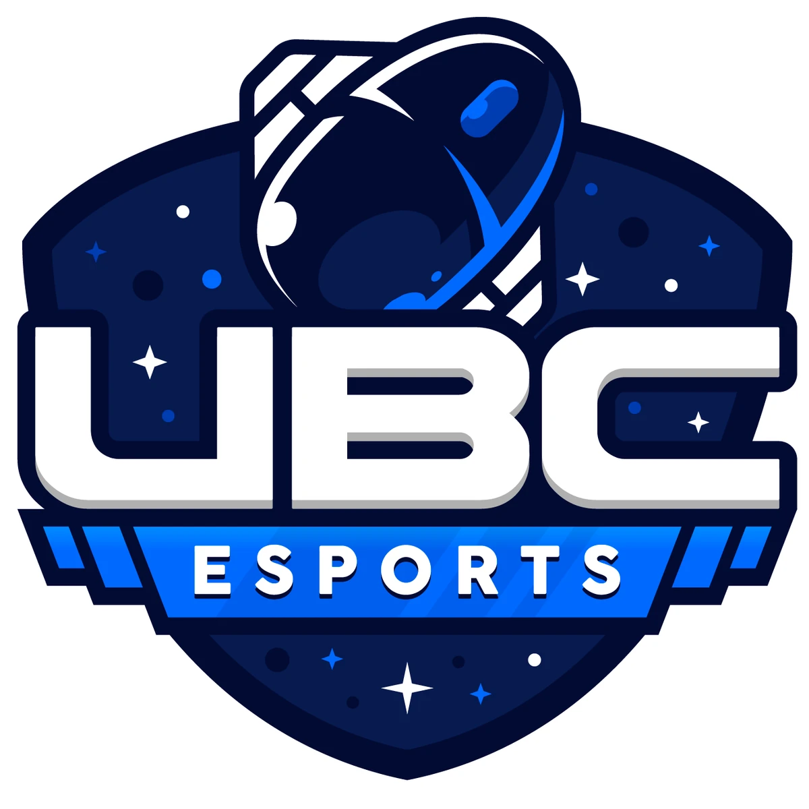
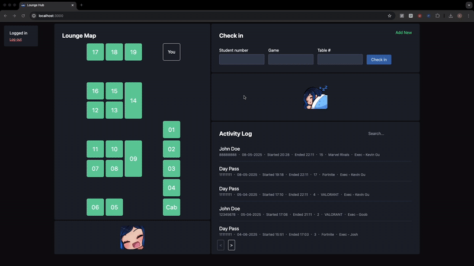
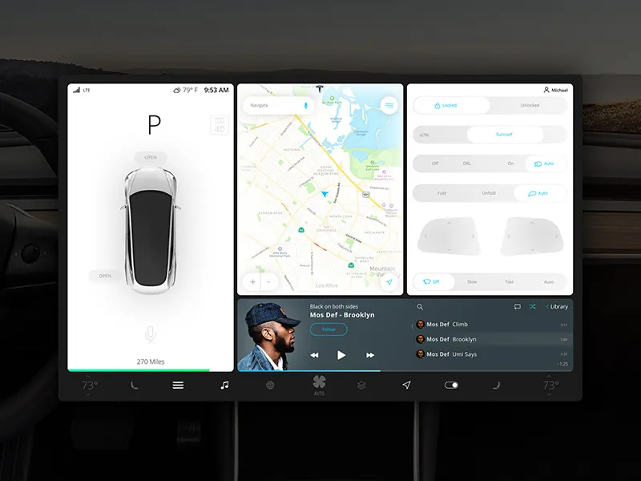
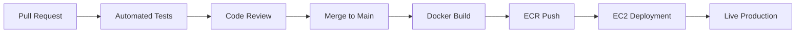

# UBC Esports Association - Software Development Portfolio

Hello! This is the lounge portal project for our UBC Esports Development team. This README.md covers the tech stack, key decision designs, the project's impact, and what we learned throughout the process.

## :gear: Key Technologies

## 🏆 Impact & Results

With this project, we...
- **reduced sign-in time by 90%** by overhauling a manual Google Sheets process
- **built a fully automated** CI/CD pipeline with zero-downtime deployments
- focused on the details by establishing **production-grade** infrastructure enhancing developer experience
- developed in a **multi-language** ecosystem to become better developers!
- won the award for **UBCEA's Best Internal Department**

<!-- ### Key Applications

| Repository | Technology | Purpose | Impact |
|------------|------------|---------|---------|
| **[lounge-hub](https://github.com/ubcesports/lounge-hub)** | TypeScript | Primary gaming lounge management application | 90% faster check-ins |
| **[lounge-portal](https://github.com/ubcesports/lounge-portal)** | Go | Member-facing portal for lounge information | Enhanced user experience |
| **[sched](https://github.com/ubcesports/sched)** | Rust | Executive shift scheduling system | Automated workforce management |
| **[echo-base](https://github.com/ubcesports/echo-base)** | Backend API | Core backend services | Centralized data management | -->

## 🎨 Design Philosophy

Our design approach focused on creating an intuitive, modular interface that prioritizes usability for our team. Taking inspiration from the Tesla Model 3's clean, functional UI, we developed a system where each section controls distinct functionality while maintaining visual cohesion.

### **Design Principles**
- **Modular Interface**: Each UI section has clear, distinct functionality - just like the Tesla Model 3's segmented control areas
- **Intuitive Navigation**: Self-explanatory layout that requires minimal onboarding for new executives
- **Keyboard-First**: Full keyboard navigation support for power users and accessibility
- **Functional Aesthetics**: Clean, distraction-free design that enhances workflow efficiency

### **Tesla Model 3 Inspiration**
We drew heavily from Tesla's approach to dashboard design, where every element serves a purpose and complex functionality is organized into digestible, modular sections.

### **Key Design Decisions**
- **Consistent Visual Language**: Unified color scheme and typography across all modules
- **Consistent, Scalable Map**: The interactive desk map is the core of our app, and reflects the real layout in our lounge
- **Progressive Disclosure**: Advanced features are accessible but don't clutter the primary interface
- **User-Centric Flow**: Designed based on actual executive workflows and pain points from the previous manual system

## 🛠 Technical Architecture

Below are languages, components, design decisions, and infrastructure we've set up for our project.

### Tech Stack
- **Frontend**: TypeScript, React, containerized development environment
- **Backend**: Node.js, PostgreSQL, RESTful API architecture
- **Infrastructure**: Docker, Nginx reverse proxy, AWS EC2
- **Additional Services (outside lounge-hub)**: Go microservices, Rust scheduling system

### DevOps & CI/CD Pipeline
Our custom-built CI/CD pipeline demonstrates enterprise-level engineering practices. For more information, [we wrote this article](https://medium.com/@jadenhums51/building-a-custom-ci-cd-pipeline-from-scratch-for-a-university-gaming-club-083b57b4ea9c)!

### **Automated Testing & Quality Assurance**
- **Unit Testing**: Mocha and Jest test suites with mandatory PR validation
- **Code Quality**: ESLint integration with blocking requirements
- **Environment Consistency**: Docker containerization across development and production

### **Deployment Infrastructure**
- **Cloud Hosting**: AWS EC2 with automated image management via ECR
- **Reverse Proxy**: Nginx configuration for HTTPS and request routing
- **Security**: Let's Encrypt SSL certificates with automatic renewal
- **Monitoring**: AWS Systems Manager for deployment status tracking

### **Release Process**

**Deployment Speed**: ~90 seconds from merge to production

## 💼 Professional Highlights

Alongside how we've grown technically, we've developed several soft skills working together in a software development team.

<!-- ### **Enterprise-Grade Practices**
- **Microservices Architecture**: We're exploring multi-language services with clear separation of concerns
- **Infrastructure as Code**: Dockerized environments with production parity
- **Automated Quality Gates**: Comprehensive testing and linting requirements
- **Zero-Downtime Deployments**: Rolling updates with health checks -->

### **Technical Leadership**
- **Cross-Functional Collaboration**: Led software development team while actively supporting club operations, socials, and events
- **Stakeholder Management**: Delivered measurable improvements to executive workflows
- **Documentation**: Comprehensive technical documentation and knowledge sharing

### **Innovation & Problem Solving**
- **Custom Solutions**: Built tailored CI/CD pipeline instead of using off-the-shelf tools, diverting budget towards providing quality events
- **Performance Optimization**: Achieved 90% performance improvement in core user flows
- **Scalability**: Designed systems to handle growing university gaming community

## 🔧 Development Experience

### Local Development Setup

View [`setup/setup.md`](/setup/setup.md) for further instructions on how to set up the project!

### Production Architecture
- **Containerized Deployment**: Docker Compose orchestration
- **Load Balancing**: Nginx reverse proxy with SSL termination
- **Database**: PostgreSQL with persistent storage
- **Monitoring**: AWS CloudWatch integration

## 📊 Technical Achievements

For our team, we're all UBC students looking to grow, build our technical toolkit, and build value with tech! Here's a snapshot of what we've learned through building this app:

- **Multi-Language Proficiency**: We successfully deployed our TypeScript app, and working on a new app with Go
- **Cloud Infrastructure**: We gained hands-on AWS experience with EC2, ECR, and Systems Manager
- **DevOps Automation**: We banded together to create a custom CI/CD pipeline reducing deployment friction
- **Security Implementation**: We learned about security practices like HTTPS, SSL certificates, and API Authentication

## 🔗 Connect & Learn More

- **Live Application**: [ubcea-lounge.ca](https://ubcea-lounge.ca) (a client-facing page is in the works!)
- **Technical Deep Dive**: [Building a Custom CI/CD Pipeline](https://medium.com/@jadenhums51/building-a-custom-ci-cd-pipeline-from-scratch-for-a-university-gaming-club-083b57b4ea9c)
- **GitHub Organization**: [@ubcesports](https://github.com/ubcesports)
- **UBCEA Website**: [ubcesports.ca](https://www.ubcesports.ca/)
