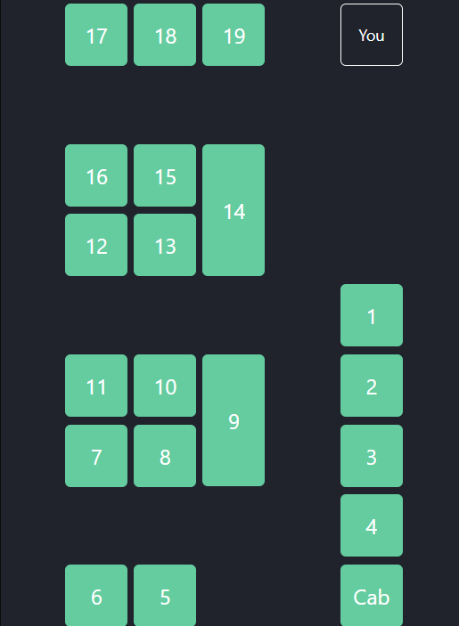

## Lounge Layout Documentation

---

The lounge map is represented by a 9x5 grid, where each cell may be a PC. For extra long PCs (ie PCs 9 and 14) their coordinates are based on the location of the upper half of the rendered component. For example, PC 9 is at location [3, 6].

Below is a table representation of each PC's coordinates, and should be updated if we ever change the layout.

|     | 1    | 2    | 3    | 4   | 5   |
| --- | ---- | ---- | ---- | --- | --- |
| 1   | PC17 | PC18 | PC19 |     |     |
| 2   |      |      |      |     |     |
| 3   | PC16 | PC15 | PC14 |     |     |
| 4   | PC12 | PC13 |      |     |     |
| 5   |      |      |      |     | PC1 |
| 6   | PC11 | PC10 | PC9  |     | PC2 |
| 7   | PC7  | PC8  |      |     | PC3 |
| 8   |      |      |      |     | PC4 |
| 9   | PC6  | PC5  |      |     | Cab |
