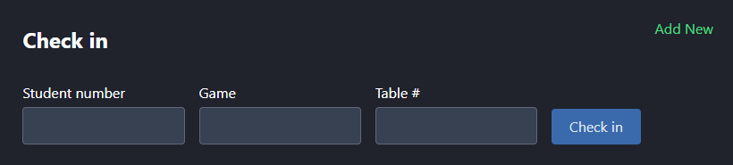
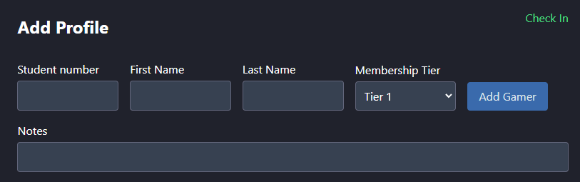

## UBCEA Lounge App Official Documentation

## Introduction

Welcome to the lounge app! This is the official guide to help you get started and make the most out of our computer lounge system.

Here is a [link](https://drive.google.com/file/d/1PYv8OYIQ7sKZhWRhkJRR2GrfvT1rjduw/view) to a video guide.

## Getting Started

**Logging in**: During the opening shift, sign into the Lounge App using the credentials found in the [Notion](https://www.notion.so/ubcea/Lounge-App-1847e3749ac280148eaec07c0abfa2c3). If you are unsure where to find this, feel free to ask in the `#development` chat on slack.

**Logging out**: It is important that we remember to log out of the Lounge App when the lounge closes. To do this, simply click the 'Log out' button in the top left of the screen.

## User Check In

1. Ask the user if they have a membership with UBCEA - if they don't, direct them to our [Showpass](https://www.showpass.com/ubcea-membership2425/) and ask them to purchase a membership, then proceed to User Sign Up instructions above. If they do have a membership, move on to step 2.
2. Ask for the user's student id card, the game that they intend on playing and if they have a preference on which PC they play on (If none or if you decide to, you may assign them a PC of your choosing).
3. In the 'Check in' box at the top right of the screen (if it says Add Profile, click the green 'Check In' to switch to the check-in form), enter in the student's information. Make sure there are no spaces and that the student number is correct. For the game, **please enter in the full title of the game** (e.g. League of Legends, not LOL or League). If it is a common game, you can click on the suggested game.
4. Press 'Check in' and the corresponding PC should update on the Lounge Map. Right below the check-in box, there should be some information about the user you just checked in, including their student number, name, membership level and notes.
5. If there is an error with check-in, verify that the user has a membership on our Showpass and follow the [User Sign Up](#user-sign-up) instructions to add their membership to our database.
6. Place the user's student id card into our alphabetically sorted folder.

**Notes**:

- If a user has a tier 1 membership, the Lounge App will warn you if they are signing in more than once a day. It is up to your discretion if you allow them to continue or not.
- If they are not a UBC student and do not have a student id, enter `11111111` for the student number.
- You don't have to select any of the dropdowns for the game.

## User Sign Up

1. If a user doesn't already have a membership, direct them to our [Showpass](https://www.showpass.com/ubcea-membership2425/) and ask them to purchase a membership, then proceed to step 2.
2. Verify that the user has purchased a membership on our end by searching for their name in the Showpass. If they paid 15 dollars, they bought a tier 1 membership. If they paid 25 dollars, they bought a tier 2 membership.
3. Ask for the user's student id card.
4. In the 'Add Profile' box at the top right of the screen (if it says Check In, click the green 'Add New' to switch to the sign-up form), enter in the student's information.
5. Follow the [User Check In](#user-check-in) steps to check them in.

**Notes**

- This form can also be used to update a student's information based on their student number. For example, if you want to add some notes to a student's profile, you can fill in their student number, name, and add some notes about them.

## User Sign Out

1. To sign a user out, click on their PC, **fill in your full name**, and click 'Check out'.

## FAQ

If you have any questions, please read this FAQ and refer to our current [issues](#issues) before contacting the `#development` channel in the Slack.

### How often does the database get updated with new memberships?

Updating the database with new information is a manual process right now. In the future we hop to run a script at set intervals to keep information up to date. Our goal is to minimize the amount of times the person on shift has to add a new user.

### How do Cab sign ins work?

In our current system, the Cab works like any other PC. If you use PC number 21, this will sign someone into the Cab.

We understand that this isn't the most effective solution and that there is usually a queue the person on shift operates. However, for now, please use the current whiteboard for the Cab queue and just sign in the first person that wants to use the Cab.

We are working on an improved Cab system so stay tuned for that.

### What if I'm having issues signing someone in?

If the app isn't working or there are major issues going on, sign the person in through the old spreadsheet system. Both the app and the spreadsheet should be linked on the sign in PC's bookmarks.

Please use the app as a first priority and only use the spreadsheet if absolutely necessary.

## Issues

GitHub allows us to track issues and features we are currently working on. This will hopefully give everyone more clarity into what the development department is currently working.

As a user, you are also allowed to create issues (you will need a GitHub account). If you spot a bug, want an improvement or a new feature, feel free to create an issue yourself!

The repository's issues can be found [here](https://github.com/ubcesports/lounge-hub/issues).
